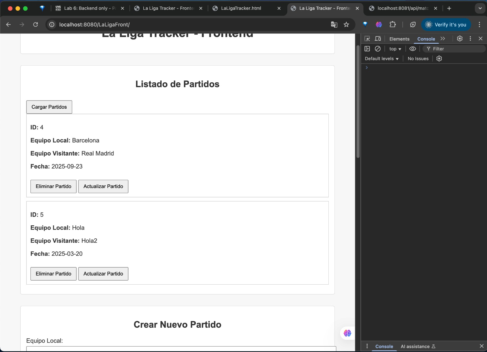
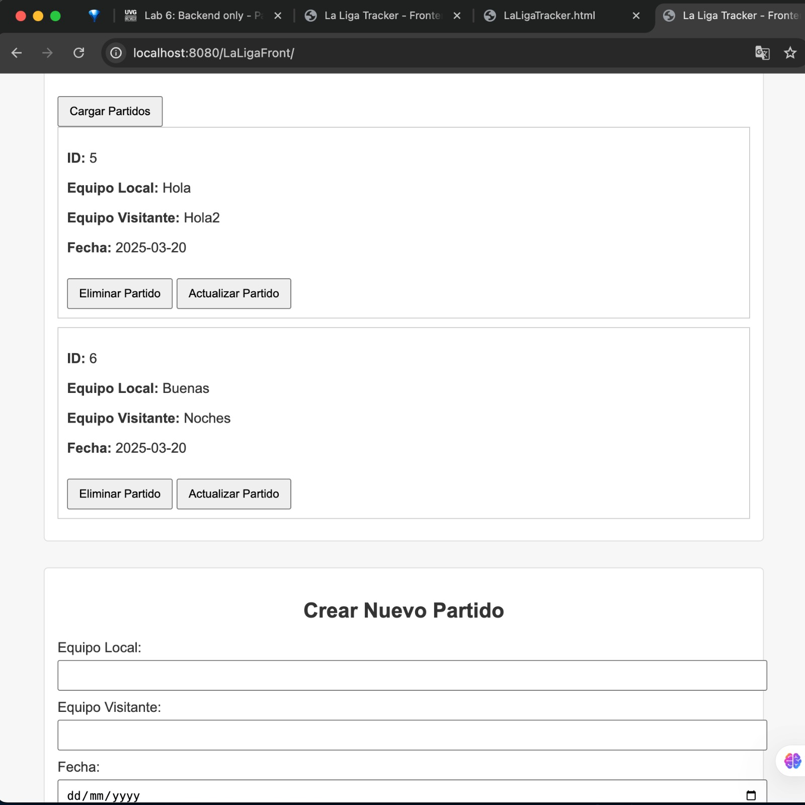
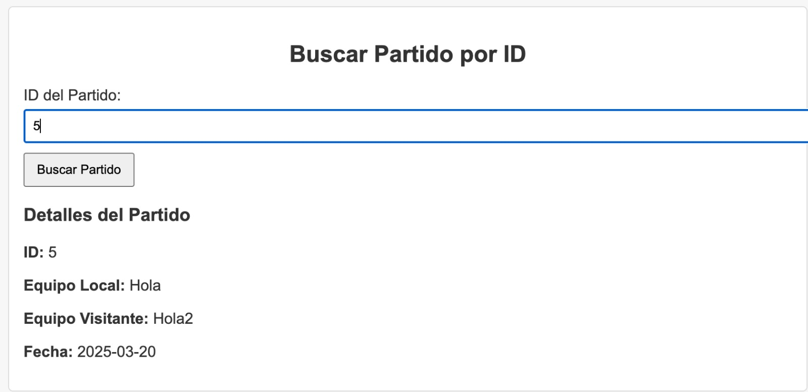
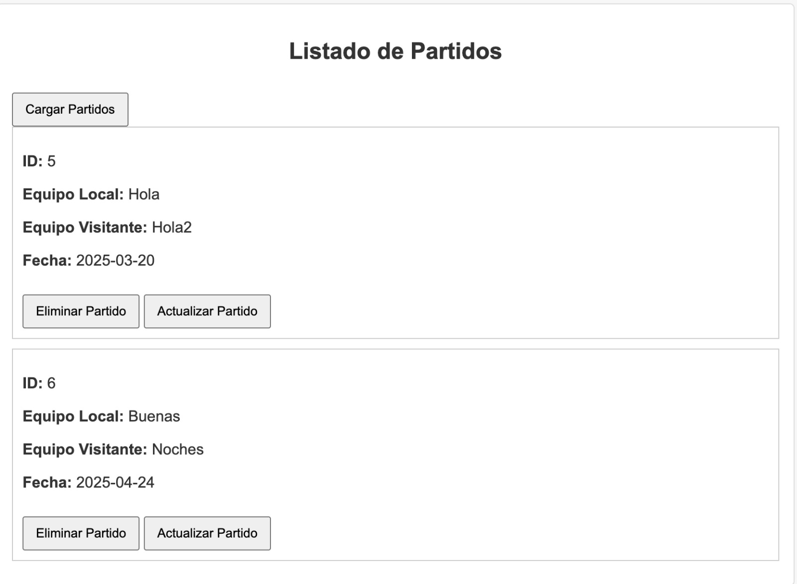
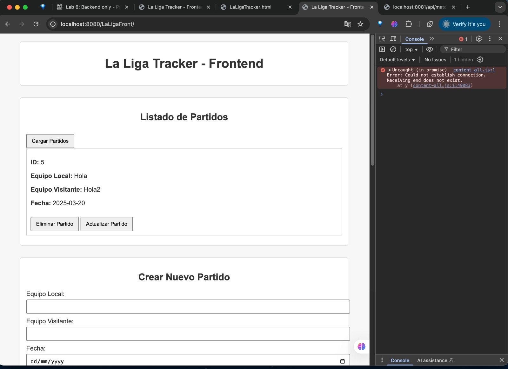
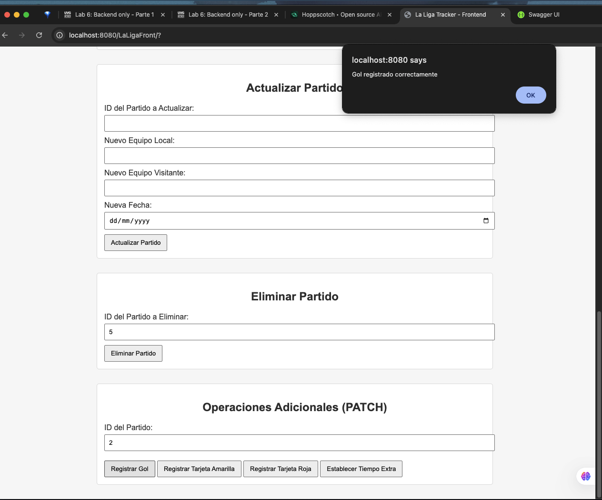
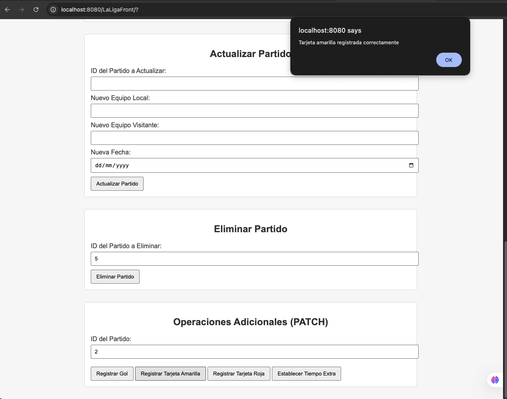
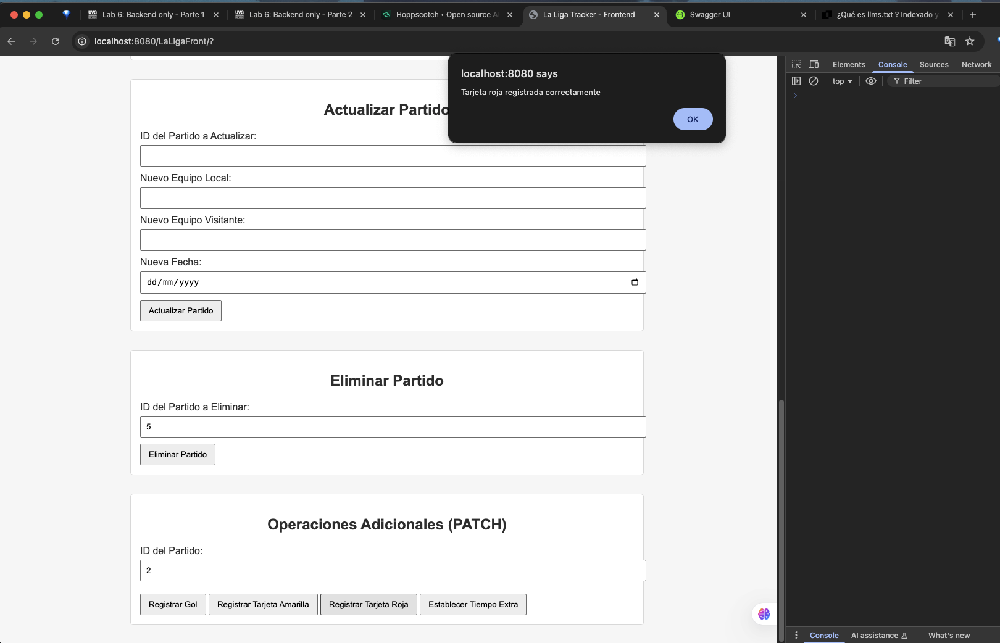
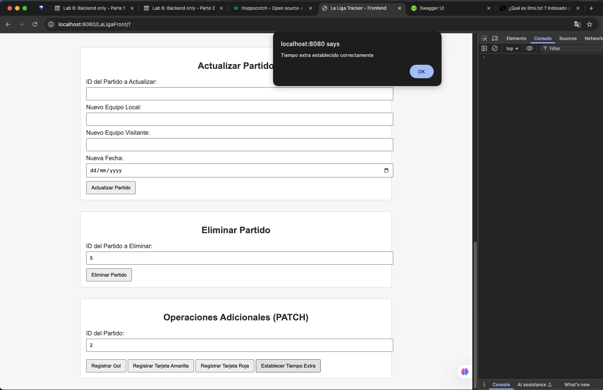

# API LaLigaTracker

## Descripción General

Este proyecto es una API que permite gestionar partidos de fútbol y realizar operaciones PATCH para goles, tarjetas amarillas, tarjetas rojas y tiempo extra. Estas aumentan el contador de la variable respectiva por uno. Está desarrollada en Go y utiliza PostgreSQL como base de datos. Además, cuenta con configuración de Docker para facilitar su despliegue, y ofrece documentación en Swagger para describir cada uno de los endpoints.

Con esta API puedes:
- Crear, obtener, actualizar y eliminar partidos.
- Registrar (vía PATCH) goles, tarjetas amarillas, tarjetas rojas y tiempo extra, incrementando sus valores por uno en cada llamada.
- Consultar la documentación detallada en un archivo `llms.txt` y un archivo `swagger.yaml`.

## Explicación de Endpoints

A continuación se describen los endpoints principales y se muestran capturas de pantalla (almacenadas en la carpeta `recursos`) que ilustran el uso y el resultado de cada operación:

### 1. GET /api/matches
Obtiene la lista completa de partidos creados hasta el momento.  
  
En esta imagen se ve cómo se listan los partidos que existían al momento de la consulta.

### 2. POST /api/matches
Crea un nuevo partido, asignándole un ID.  
  
Se observa cómo se creó el partido con un ID (en el ejemplo, se ve el ID 6) y luego aparece en la lista de partidos.

### 3. GET /api/matches/{id}
Obtiene la información de un partido específico.  
  
Aquí se visualiza la información correspondiente a ese ID.

### 4. PUT /api/matches/{id}
Actualiza todos los datos de un partido existente (por ejemplo, la fecha).  
  
En la captura se muestra la actualización de la fecha del partido con ID 6.

### 5. DELETE /api/matches/{id}
Elimina un partido existente.  
  
En la imagen se observa cómo se elimina el partido con ID 6.

### 6. PATCH /api/matches/{id}/goals
Incrementa la cantidad de goles en 1.  

### 7. PATCH /api/matches/{id}/yellowcards
Incrementa en 1 la cantidad de tarjetas amarillas.  

### 8. PATCH /api/matches/{id}/redcards
Incrementa en 1 la cantidad de tarjetas rojas.  

### 9. PATCH /api/matches/{id}/extratime
Incrementa en 1 la cantidad de tiempo extra.  

> Para una descripción más detallada de cada endpoint, consulta:
> - El archivo `llms.txt`.
> - El archivo `swagger.yaml`.

## swagger.yaml
Se incluye el archivo `swagger.yaml` que describe la API en formato OpenAPI 3.0. Dentro del `docker-compose.yml` que se genere, se ha configurado un contenedor `swagger` que expone la documentación en el puerto `8082`. Al levantar ese contenedor, podrás acceder a `http://localhost:8082` y visualizar la documentación interactiva con Swagger UI.

## Docker
Este proyecto se puede ejecutar con Docker. Para ello:

1. Configura un archivo docker-compose.yml, utilizando de base lo que contiene el archivo de ejemplo docker-compose.yml.example.
2. Ajusta las variables de entorno en tu `.env`, guiandote por lo que está en el archivo .env.example.
3. Levanta los contenedores con: `docker-compose up -build`

### Archivos para Docker
- `.env.example`: Contiene variables como `DB_HOST`, `DB_USER`, `DB_PASSWORD`, `DB_NAME` y `PORT`.
- `docker-compose.yml.example`: Expone la configuración de servicios (PostgreSQL, backend en Go, y Swagger UI).
- `Dockerfile`: Indica cómo compilar la aplicación Go y generar una imagen final basada en Alpine.

## Postman

Se generó una colección en Postman para probar los endpoints de manera sencilla. Cabe mencionar, que la URL base que utilicé fue `http://localhost:8081`, y sobre esta fui probando los diferentes endpoints, al ingresar a la colección, esta URL base se debería modificar a lo que se adapté a sus necesidades.

[Postman Collection](https://bryanmartinez-1008864.postman.co/workspace/Bryan-Martinez's-Workspace~e5d99082-6f3d-4c98-8a3b-9fe0f80a2fd1/collection/43507428-6a4fcdec-9caa-4916-8ac7-aa2eebc7acca?action=share&creator=43507428)
